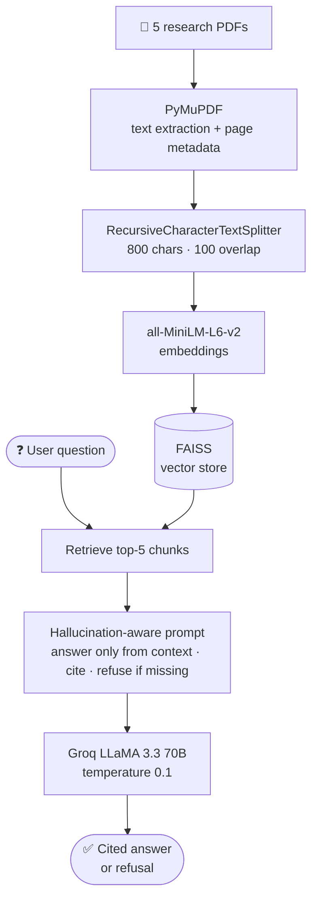

# 🧠 PCOS × Neurodivergence — Medical RAG Assistant

[](https://colab.research.google.com/github/mistyvisty/pcos-neurodivergence-rag/blob/main/PMOS_Neurodivergence_RAG_v2.ipynb)


> A Retrieval-Augmented Generation (RAG) pipeline grounded in 5 peer-reviewed clinical research papers.
> Answers questions about the PCOS–neurodivergence connection with **page-level citations**, and is designed to **refuse rather than guess** when the papers don't contain the answer.

---

## 🎯 Why This Project

PCOS and neurodivergence (ADHD, autism) are linked in a growing body of research, but the evidence is scattered across dense clinical papers. A general-purpose chatbot answering medical questions from its training data can confidently state things no study supports.

This assistant answers **only from the papers you give it**, cites the exact paper and page for each claim, and says so when the evidence isn't there.

---

## 📌 What It Does

- Ingests peer-reviewed research papers on PCOS and neurodivergence
- Lets you ask questions in natural language
- Returns answers with a citation on each claim: `[Source: <paper>, Page <n>]`
- Refuses to answer when the retrieved context is insufficient, with a fixed refusal message instead of a guess
- Shows exactly which chunks were retrieved for any question (transparency step)
- Runs entirely in Google Colab, with no local setup

---

## 📋 Pipeline



### Design choices

| Choice | Why |
|---|---|
| **Page-level metadata kept from extraction** | Every chunk carries its paper name and page number, so citations point to a real location |
| **800-char chunks, 100 overlap** | Small enough for precise retrieval; overlap avoids splitting a finding across chunks |
| **Top-5 retrieval** | Enough context to combine evidence across papers without flooding the prompt |
| **Temperature 0.1** | Keeps answers close to the source text |
| **Fixed refusal sentence** | *"The uploaded research papers do not contain sufficient information to answer this question."* A fixed string makes refusals easy to detect and test |
| **No diagnostic claims** | The prompt requires findings to be presented as research evidence, not medical advice |

---

## 🗂️ Research Papers Used

> ⚠️ **PDFs are not included in this repo** because some are copyrighted.
> Download them using the links below and upload them when the notebook prompts you.

| Filename | Paper | Access |
|---|---|---|
| `pmos.pdf` | Cherskov et al. (2018) — *PCOS and Autism: A test of the prenatal sex steroid theory.* Translational Psychiatry. DOI: [10.1038/s41398-018-0186-7](https://doi.org/10.1038/s41398-018-0186-7) | 🔓 Open Access |
| `pmos1.pdf` | Redkar & Khan (2025) — *The impact of PCOS on attention: an empirical investigation.* BioPsychoSocial Medicine. DOI: [10.1186/s13030-024-00320-w](https://doi.org/10.1186/s13030-024-00320-w) | 🔓 Open Access |
| `pmos2.pdf` | Berni et al. (2018) — *PCOS is associated with adverse mental health and neurodevelopmental outcomes.* J Clin Endocrinol Metab. DOI: [10.1210/jc.2017-02667](https://doi.org/10.1210/jc.2017-02667) | 🔒 Paywall |
| `pmos3.pdf` | Dubey et al. (2021) — *Systematic review and meta-analysis: maternal PCOS and neuropsychiatric disorders in children.* Translational Psychiatry. DOI: [10.1038/s41398-021-01699-8](https://doi.org/10.1038/s41398-021-01699-8) | 🔓 Open Access |
| `pmos4.pdf` | Chen et al. (2020) — *PCOS or anovulatory infertility and offspring psychiatric disorders: a Finnish population-based cohort study.* Human Reproduction. DOI: [10.1093/humrep/deaa192](https://doi.org/10.1093/humrep/deaa192) | 🔓 Open Access |

> 💡 Open Access papers can be downloaded directly from the DOI link. For the paywalled paper, try [Unpaywall](https://unpaywall.org) or your institution.
>
> **Keep the filenames exactly as shown.** The notebook maps them to readable citation names (e.g. `pmos.pdf` → `Cherskov_2018_PCOS_Autism`).

---

## 🛠️ Tech Stack

| Component | Tool |
|---|---|
| PDF extraction | PyMuPDF (`fitz`) |
| Chunking | LangChain `RecursiveCharacterTextSplitter` |
| Embeddings | HuggingFace `all-MiniLM-L6-v2` |
| Vector store | FAISS |
| Orchestration | LangChain (LCEL chain) |
| LLM | Groq — LLaMA 3.3 70B Versatile |
| Hallucination guard | System prompt: context-only answers, mandatory citations, fixed refusal |
| Interactive UI | `ipywidgets` (non-blocking input) |

---

## 🚀 How to Run

**1. Open the notebook** — click **Open in Colab** at the top.

**2. Add your Groq API key** (free at [console.groq.com](https://console.groq.com))
- In Colab, click the 🔑 key icon in the left sidebar → **Add new secret**
- Name: `GROQ_API_KEY` → paste your key → turn **Notebook access** ON

**3. Download the 5 papers** using the DOI links above and name them `pmos.pdf` … `pmos4.pdf`.

**4. Run all cells in order**

```
Step 1  → Install dependencies
Step 2  → Load & verify API key
Step 3  → Upload PDFs
Step 4  → Extract text (with paper + page metadata)
Step 5  → Chunk documents
Step 6  → Build FAISS vector store
Step 7  → Set up Groq LLM + RAG chain
Step 8  → Ask sample questions
Step 9  → Inspect retrieved chunks
Step 10 → Interactive Q&A widget
Bonus   → Paper coverage summary
```

---

## 💬 Example Questions

```python
ask("Are children of mothers with PCOS at higher risk of autism spectrum disorder?")
# → Yes — studies found increased odds [Cherskov 2018, Dubey 2021]

ask("What mental health disorders are most commonly associated with PCOS?")
# → Depression, anxiety, bipolar disorder, eating disorders [Berni 2018]

ask("Does insulin resistance in PCOS contribute to cognitive impairment?")
# → Yes — impairs glucose metabolism and neural processing [Redkar 2025]

ask("What is the prenatal sex steroid theory of autism?")
# → Elevated prenatal testosterone during neurological sex differentiation → autism risk

ask("What did the Finnish cohort study find about maternal PCOS?")
# → Increased risk of neuropsychiatric disorders in children [Chen 2020]
```

---

## 📁 Repo Structure

```
pcos-neurodivergence-rag/
├── PMOS_Neurodivergence_RAG_v2.ipynb   ← main notebook
├── README.md
└── .gitignore                          ← excludes PDFs
```

---

## ⚠️ Limitations

- **Refusal is prompt-based** — it strongly reduces guessing, but it isn't a hard guarantee
- **No formal evaluation yet** — answers and refusals have been checked manually, not with a labeled test set
- **Dense retrieval only** — exact medical terms and abbreviations can be missed by embedding search alone
- **Small corpus** — 5 papers, so the assistant can't speak to research outside them

## 🔄 v2: Advanced RAG

I rebuilt this pipeline with **Pinecone, BM25 + dense hybrid search, Reciprocal Rank Fusion and CrossEncoder reranking**, and A/B tested it against this FAISS version:
👉 [pcos-neurodivergence-advanced-rag-pinecone](https://github.com/mistyvisty/pcos-neurodivergence-advanced-rag-pinecone)

📝 Write-up: [I Built an AI That Reads Clinical Research Papers and Answers Questions About PCOS and Neurodivergence](https://medium.com/@bhardwajpreeti357/i-built-an-ai-that-reads-clinical-research-papers-and-answers-questions-about-pcos-and-b1f526784409)

---

## ⚠️ Disclaimer

This tool is for **research and educational purposes only**. It is not a medical diagnostic tool, and its answers should not be used as clinical advice. Always consult a qualified healthcare professional.

---

## 👩‍💻 Author

**Preeti Bhardwaj** — Software Developer | GenAI & Agentic Systems | RAG & LLM Engineering

[Portfolio](https://mistyvisty.github.io/) · [GitHub](https://github.com/mistyvisty) · [Medium](https://medium.com/@bhardwajpreeti357)
